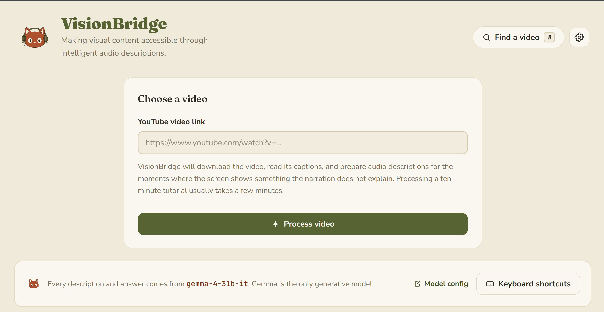
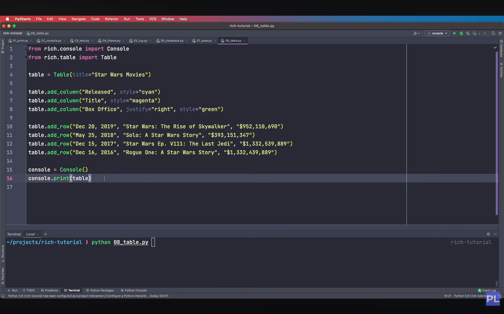
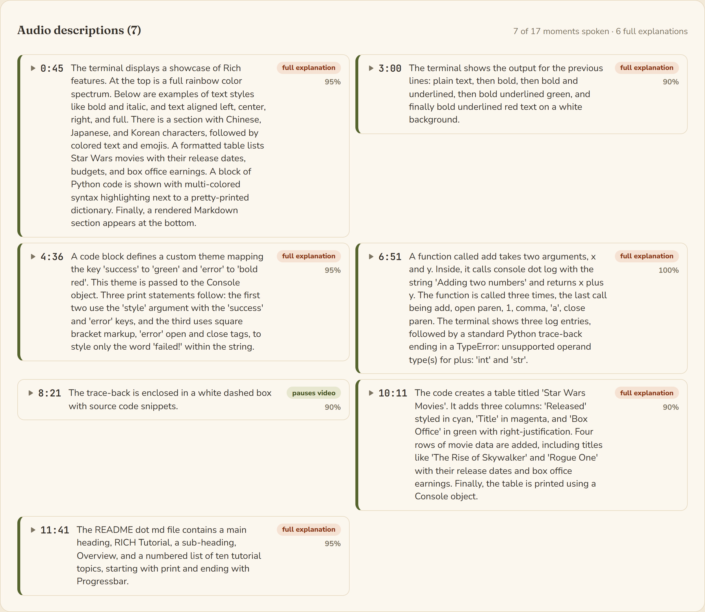
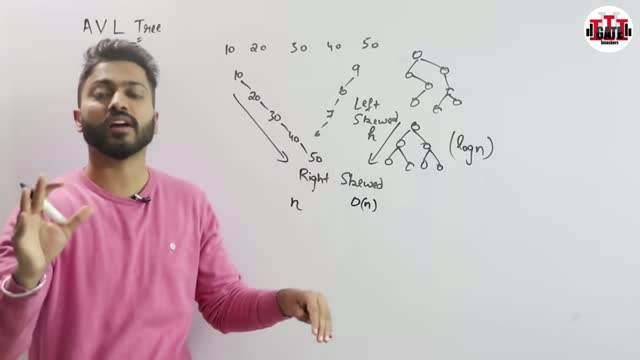
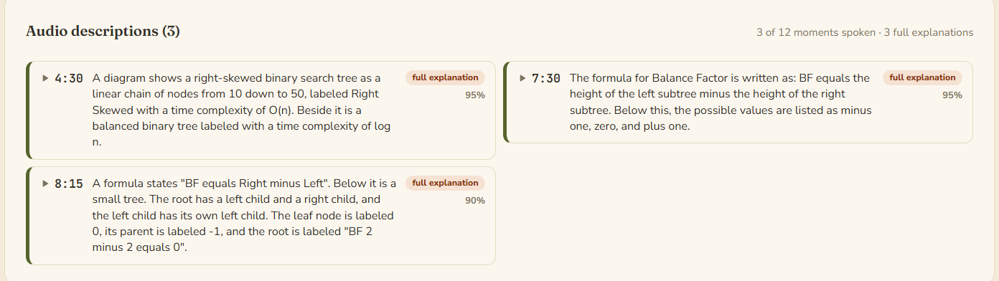
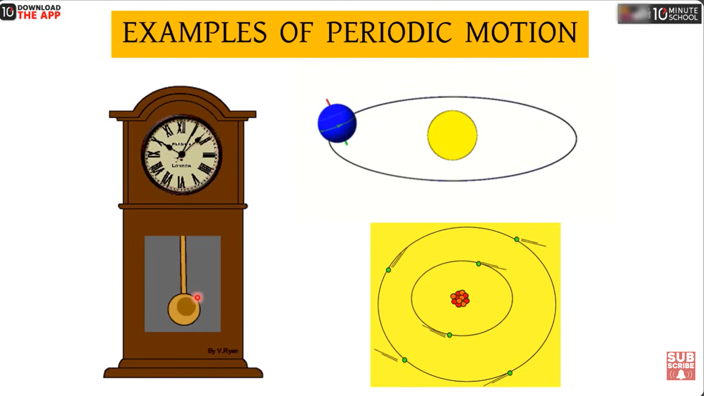
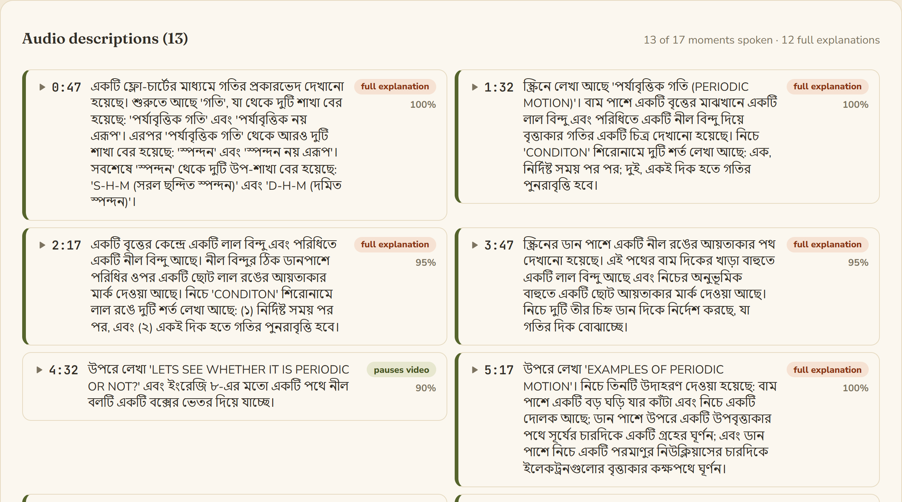
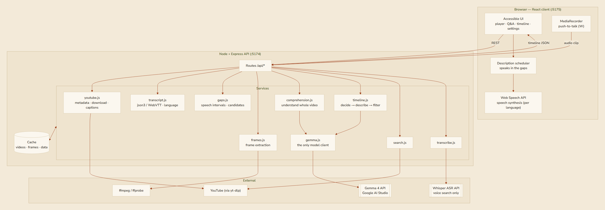

<p align="center">
  
</p>

<h1 align="center">VisionBridge</h1>

<p align="center"><strong>Making visual content accessible through intelligent audio descriptions.</strong></p>

VisionBridge is a **Gemma‑powered accessibility companion** that lets blind and low‑vision learners
independently follow visual YouTube tutorials. It reads the transcript, looks at the video frames,
decides **whether visual information is actually necessary**, and speaks a short description only
when it is — during the natural pauses in the narration.

Built for the **Build with Gemma Hackathon**. Gemma 4 is the only generative model in this codebase,
and that is enforced in code rather than promised in a README (see [Gemma compliance](#gemma-compliance)).



---

## The problem

A huge amount of learning happens on YouTube — coding walkthroughs, maths lectures, data tutorials.
Almost all of it is **deeply visual**: code on screen, a diagram, a graph, a terminal, a formula.
For a blind or low‑vision learner, the existing options both fail:

- **Screen readers / captions** read the *words*, and miss everything the instructor points at,
  writes, or draws. "As you can see here…" becomes a dead end.
- **Describe‑everything tools** narrate every frame and **talk over the instructor**, turning a
  lesson into noise.

Neither is usable for actually *learning*. The result is that visual tutorials — some of the best
free education available — are effectively closed to millions of learners.

## What VisionBridge does

VisionBridge asks a different question first. Instead of *"What is on screen?"* Gemma is asked:

> **"Can the learner follow this lesson without seeing the screen?"**

Only when the answer is *no* does it generate a description, and it places that description **in a
natural pause** so it never overlaps the instructor. This **decide‑first, describe‑second** workflow
is the core of the project, and it is why the app is quiet most of the time.

The design rule behind everything: **silence is better than a wrong description.**

---

## Case studies

Three real videos we ran through VisionBridge. Each one shows the frame Gemma looked at, the exact
description it spoke into a pause in the narration, and why that mattered for a blind learner.

### 1 · Coding — Python terminal styling with the Rich library

<sub><code>youtube.com/watch?v=4zbehnz-8QU</code></sub>



**At 10:11**, the instructor is building this table but narrates only loosely — *"…and then we can add
different columns…"* — without ever reading the column names, their colours, or the rows on screen.
So VisionBridge reads the code aloud:

> *"The code creates a table titled 'Star Wars Movies'. It adds three columns: 'Released' styled in
> cyan, 'Title' in magenta, and 'Box Office' in green with right‑justification. Four rows of movie
> data are added, including titles like 'The Rise of Skywalker' and 'Rogue One'… Finally, the table is
> printed using a Console object."*

**Why it matters** — a blind programmer hears the code's exact shape: its three styled columns, that
rows are added, and that it is printed — the way they'd navigate it themselves, without every
keystroke being narrated.

And it knows when to stay quiet. Across the whole video Gemma spoke at just **7 of 17 moments** — code
blocks, terminal output, even a Python **traceback** (`TypeError: unsupported operand type(s) for +:
'int' and 'str'`) — and left everything else to the narration:



### 2 · Math & diagrams — AVL trees

<sub><code>youtube.com/watch?v=E9DOBLNB-aE</code></sub>



**At 4:30**, the instructor says *"…in the worst case the binary search tree is spoiled"* and pauses,
pointing at a diagram the blind learner can't see. VisionBridge speaks into that silence:

> *"A diagram shows a right‑skewed binary search tree as a linear chain of nodes from 10 down to 50,
> labeled Right Skewed with a time complexity of O(n). Beside it is a balanced binary tree labeled
> with a time complexity of log n."*

**Why it matters** — "spoiled" is meaningless without the picture. Now the learner hears the whole
idea: a degenerate chain at **O(n)** versus a balanced tree at **O(log n)** — the entire reason the
lecture exists.

Here is how descriptions like this appear in the app:



### 3 · Bengali — periodic motion (physics)

<sub><code>youtube.com/watch?v=__hAtkj05Ms</code></sub>



**At 5:23**, the "Examples of Periodic Motion" slide appears. The instructor says *"…there are four
periodic motions here — let's start with the first…"* and then talks through only the clock, never
naming the other pictures. VisionBridge describes the whole slide — in Bangla:

> উপরে লেখা 'EXAMPLES OF PERIODIC MOTION'। নিচে তিনটি উদাহরণ দেওয়া হয়েছে: বাম পাশে একটি বড় ঘড়ি যার কাঁটা
> এবং নিচে একটি দোলক আছে; ডান পাশে উপরে একটি উপবৃত্তাকার পথে সূর্যের চারদিকে একটি গ্রহের ঘূর্ণন; এবং ডান
> পাশে নিচে একটি পরমাণুর নিউক্লিয়াসের চারদিকে ইলেকট্রনগুলোর বৃত্তাকার কক্ষপথে ঘূর্ণন।

> *In English: "The screen reads 'Examples of Periodic Motion'. Three examples are shown — on the
> left, a large clock with hands and a pendulum below it; top‑right, a planet orbiting the sun in an
> elliptical path; bottom‑right, electrons orbiting an atom's nucleus in circular paths."*

**Why it matters** — a sighted student instantly takes in clock, planet, and atom; a blind Bengali
learner would hear only "let's start with the first." VisionBridge anchors the abstract idea of
periodic motion to concrete, familiar systems — in the learner's own language, spoken with a Microsoft
Edge Bangla voice.

Every moment it chose to describe, generated **in Bengali**:



---

## Key features

- **Decide‑first descriptions.** Every candidate moment is a *decision* before it is a description.
  Most of the time the answer is silence.
- **Brief vs. full explanations.** A short pointer fits inside a pause; a complex visual (a graph, a
  derivation, a finished block of code) earns a full **Extended Audio Description** that pauses the
  video so it can be delivered completely.
- **Interactive assistant.** Pause any time and ask about the exact frame on screen — *"read the
  code", "explain this formula", "what changed?"* — by keyboard or free text.
- **Find a video by voice.** Hold **W** and *speak* a search; Whisper transcribes it, YouTube is
  searched, and the top result plays — hands‑free. (Or type / paste a link.)
- **Multilingual.** Describes a lesson in the language it is actually taught in — English, Bengali,
  and beyond (see [Languages & voices](#languages--voices)).
- **Accessible by construction.** Full keyboard control, screen‑reader announcements, WCAG‑AA
  contrast, a high‑contrast mode, and native controls throughout.
- **Gemma‑only, enforced in code.** No other LLM or generative model can be reached through this
  codebase.

---

## System architecture



**Everything generative is Gemma.** yt-dlp (search + download), ffmpeg (frames), and Whisper
(speech‑to‑text for voice search) are permitted *supporting* technologies — none is an LLM or a
generative model. See [Gemma compliance](#gemma-compliance).

### How the pipeline works

```
YouTube URL / spoken search
        │
        ▼
yt-dlp ──► video (cached)          yt-dlp ──► captions ──► transcript cues (with language)
        │                                                        │
        │                        ┌────────────────────────────────┤
        │                        ▼                                ▼
        │            GEMMA reads title + whole transcript    speech intervals
        │                   (comprehension pass)                  ▼
        │            understanding: domain, concepts,       natural pauses (gaps)
        │            glossary, expected visuals                   │
        │                        │                         candidate timestamps
        │                        └───────────────┬─────────────────┘
        ▼                                        ▼
ffmpeg ─────────► frame (640px JPEG) ──┬── nearby transcript ── understanding
                                       ▼
                                    GEMMA  (decide, then describe)
                                       │
                       ┌───────────────┴───────────────┐
                needed:false                     needed:true
                       │                    ┌──────────┴──────────┐
                    silence            mode:"brief"          mode:"explain"
                                    short pointer,        full explanation,
                                    fits a pause          pauses the video
                                            └──────────┬──────────┘
                                              confidence filter
                                                      │
                                              cached timeline
                                                      │
                                                      ▼
                                  browser scheduler speaks in the gaps
                                  (or pauses the video for an explanation)
```

**Understand the whole video first.** Before a single frame is judged, Gemma reads the title and the
complete transcript once and forms a compact understanding of the lesson: its **domain** (coding,
math, data, UI, science), the key concepts, a glossary of how to *say* tricky terms aloud
(`ReLU → "ray‑loo"`), and which visuals are likely to carry unspoken information. This understanding
rides along on every per‑frame decision, so descriptions use the lesson's own vocabulary. It is one
cheap text‑only call, cached per video.

**Where descriptions may happen.** Transcript cues become merged **speech intervals**; the complement
is the **silence**. Any silence of at least `MIN_GAP_SECONDS` is a candidate — VisionBridge can speak
there without ever overlapping the instructor. When narration runs for `FORCED_CANDIDATE_INTERVAL`
seconds with no usable pause, a candidate is added anyway and marked as one that must **pause the
video** (Extended AD).

**The confidence rules.** ≥ `CONFIDENCE_HIGH` (0.85) → speak. Between `CONFIDENCE_CRITICAL` and
`HIGH` (0.6–0.85) → speak only when the content is genuinely learning‑critical. Below
`CONFIDENCE_CRITICAL` (0.6) → discard. A malformed model response is treated as "no description" —
never as a guess.

---

## Languages & voices

VisionBridge is **not English‑only**. It captions a lesson in the language it is actually taught in,
then — because Gemma is multilingual — describes and answers in that same language, spoken aloud in
the learner's own tongue. One detected language value flows through the whole system: caption fetch →
prompts → browser speech. Nothing in the timing or gap logic is language‑specific.

> [!IMPORTANT]
> **Use Microsoft Edge to test Bangla and other non‑English languages.** Descriptions are *generated*
> correctly in any language by Gemma, but they are *spoken* with the browser's voices — and **only
> Edge ships online voices for Bangla, Hindi, and most other languages out of the box.** In Chrome,
> non‑English speech usually needs an OS voice installed first (see below). This is a browser/OS
> limitation, not a limitation of VisionBridge.

| Setting | Default | What it does |
|---|---|---|
| `CAPTION_LANGS` | `auto` | Reads the video's own caption tracks (a Bengali tutorial gets Bengali captions). Or a comma list like `bn,en`. |
| `OUTPUT_LANG` | `auto` | Language of descriptions and answers. `auto` mirrors the narration; a code like `bn` forces one language. |

### Speech depends on the browser's voices — use **Microsoft Edge** for non‑English

Descriptions are spoken with the browser's **Web Speech API**, which can only use the voices the
device actually has. This is where the browser matters:

- **Microsoft Edge** exposes Microsoft's **online neural voices** for many languages, including
  **Bengali** (`bn-IN`, `bn-BD`), Hindi, and dozens more — with no installation. **For Bangla and
  most non‑English languages, use Edge.** It is the most reliable path and needs only an internet
  connection.
- **Chrome** generally only has whatever voices the operating system has installed, so non‑English
  voices are often missing.

When a video's language has **no installed voice**, VisionBridge tells the learner (rather than
reading the text with a mismatched voice), and shows how to fix it.

### Making it work for another language

1. **Captions** — leave `CAPTION_LANGS=auto` (it uses the video's own tracks), or set it explicitly,
   e.g. `CAPTION_LANGS=bn,en`.
2. **Output** — leave `OUTPUT_LANG=auto` to mirror the narration, or force it, e.g. `OUTPUT_LANG=bn`
   to always describe in Bengali.
3. **Voice** — get a voice for that language:
   - **Easiest:** open the app in **Microsoft Edge** — its online voices cover most languages.
   - **Or install an OS voice:** on Windows, *Settings → Time & language → Language & region → Add a
     language → (check Text‑to‑speech)*; then restart the browser so `speechSynthesis` picks it up.
4. **Check what you have** — in the browser console:
   ```js
   speechSynthesis.getVoices().filter(v => v.lang.startsWith('bn'))
   ```
   If that returns a voice, spoken output in that language will work.

> **Limitation:** a video with **no captions in any language** can't be processed — gap detection
> needs to know when the instructor is speaking, and captions provide that.

---

## Find a video: search by voice or text

You don't need a URL. Press **W** (or the **Find a video** button) to open search:

- **Hold W and speak** — VisionBridge records a short clip, transcribes it with **Whisper**, searches
  YouTube, and **plays the top result** automatically. Fully hands‑free — ideal for a blind learner.
- **Type a search** — pick from the results.
- **Paste a YouTube link** — it loads straight away.

Text search works with no extra setup (it uses yt‑dlp's built‑in search). **Spoken** search needs an
OpenAI key for Whisper — see [Voice search setup](#voice-search-setup-optional). You can also deep‑link
a video: `http://localhost:5175/?v=<id-or-url>`.

---

## Quick start

### 1. Prerequisites

| Requirement | Check | Install |
|---|---|---|
| Node.js 20+ | `node --version` | <https://nodejs.org> |
| yt‑dlp | `yt-dlp --version` | `pip install yt-dlp` |
| ffmpeg + ffprobe | `ffmpeg -version` | `winget install Gyan.FFmpeg` · `brew install ffmpeg` · `apt install ffmpeg` |
| Gemma API key | — | <https://aistudio.google.com/apikey> (free) |

Node dependencies install with `npm install`. The runtime stack is small and pinned in the
`package.json` files: **server** — Express, CORS, dotenv; **client** — React + Vite. No AI SDKs:
Gemma and Whisper are called over plain HTTPS.

### 2. Configure

```bash
cp .env.example .env      # then add your key
```

```dotenv
GEMMA_API_KEY=your-key-here
GEMMA_MODEL=auto
```

`GEMMA_MODEL=auto` picks the newest vision‑capable Gemma your key can reach. Anything that is not a
Gemma model is refused at startup. Gemma 4 serves two multimodal ids through the Gemini API:

| Model | Notes |
|---|---|
| `gemma-4-31b-it` | Dense 31B — most capable. The default. |
| `gemma-4-26b-a4b-it` | Mixture‑of‑experts, 4B active — faster and cheaper per frame. Good for demos. |

### 3. Verify (Phase 0)

```bash
npm install
npm run doctor          # add --full to also test download + frame extraction
```

The doctor checks every assumption the project rests on: binaries, API key, a real Gemma vision call
against a synthetic image, YouTube metadata, and transcript extraction. **Do not continue until it
passes.**

### 4. Run

```bash
npm run dev             # API on :5174, accessible UI on http://localhost:5175
```

Or build once and serve everything from the API:

```bash
npm run build && npm start      # http://localhost:5174
```

> [!IMPORTANT]
> **Testing a Bangla (বাংলা) or other non‑English video? Open the app in Microsoft Edge.**
> Spoken descriptions use the browser's built‑in voices, and **Edge is the only common browser that
> ships online voices for Bangla (`bn-IN`, `bn-BD`), Hindi, and most other languages** — with nothing
> to install. Chrome only has whatever voices your operating system happens to have, so non‑English
> speech is often silent or read with a wrong‑language voice. English works in any browser.
> See [Languages & voices](#languages--voices).

---

## Voice search setup (optional)

Spoken search (**hold W**) transcribes your voice with **Whisper**. This is optional — text search
and everything else works without it.

```dotenv
OPENAI_API_KEY=sk-...     # enables spoken search
WHISPER_MODEL=whisper-1
```

Add the key to `.env` and **restart the server** (`.env` is read only at startup). Until then, the
microphone button is hidden and the search dialog offers typing instead.

Whisper is **Automatic Speech Recognition** — a permitted *supporting* technology, not an LLM, and it
generates no content. It lives behind a single `transcribe()` function
([`server/src/services/transcribe.js`](server/src/services/transcribe.js)), so swapping to a local
Whisper (e.g. whisper.cpp) is a one‑file change. **Gemma stays the only generative model.**

---

## Gemma compliance

Gemma is the **only** generative model, and the constraint is mechanical:

- `assertGemmaOnly()` in [`server/src/config.js`](server/src/config.js) validates every model id
  against `/^(models\/)?gemma[-\d.]/i`. Every request path calls it before dispatch.
- Startup refuses to open the port if the configured model is not a Gemma model, or if no
  vision‑capable Gemma is reachable. It never silently substitutes another model.
- `GET /api/config` reports the model actually in use, the models considered, and the policy.
- `server/tests/config.test.js` asserts that GPT, Claude, Gemini, Llama and Mistral ids are all
  rejected — including that `gemini` is not mistaken for `gemma`.
- **Supporting technologies** (explicitly permitted): yt‑dlp for search/download, ffmpeg for frames,
  and Whisper for speech‑to‑text. None is an LLM or a generative foundation model.

```bash
curl http://localhost:5174/api/config
```

---

## Technical challenges (and how they were solved)

- **Gemma 4 reasons before it answers, and that thinking is billed against `maxOutputTokens`.** A
  tight budget is spent before the answer even starts (returning `MAX_TOKENS` with nothing usable),
  and the reasoning routinely quotes the JSON schema — so a naive join hands the parser a decoy
  object. Solved with generous budgets (1500 for a decision, 3000 for Q&A) and `extractAnswerText()`,
  which separates the `thought:true` part from the answer. Pinned by tests.
- **Never overlapping the narrator.** Descriptions must land in silences; a description that outlasts
  its gap pauses the video; and if the learner force‑resumes mid‑description (play button, space, or
  clicking the player) speech must stop. Solved with gap detection plus a shared "holding playback"
  flag and `speechSynthesis.speaking` as ground truth — robust to YouTube's
  `PAUSED → BUFFERING → PLAYING` resume, which an earlier transition‑based fix missed.
- **Multilingual without special‑casing.** One detected language flows from the video's own captions
  through the prompts to the browser voice; the real constraint is TTS voice availability, handled by
  detecting it and telling the learner (Microsoft Edge's online voices cover most languages).
- **Voice search that stays Gemma‑only.** Whisper (ASR) is isolated behind a single `transcribe()`
  function and pinned to English for search queries to avoid language mis‑detection, so Gemma remains
  the only generative model.

## Accessibility

Accessibility is part of the MVP, not a later pass. The whole application is operable with a keyboard
and a screen reader, and nothing requires sight.

- Skip link, landmark structure, and a heading hierarchy that matches the visual one.
- Two ARIA live regions: polite for progress and state, assertive for errors and Q&A.
- Every control is a native `button`, `input`, or `select` — no custom widgets to get wrong.
- The YouTube iframe is `aria-hidden` and keyboard‑disabled, so focus never falls into a player a
  blind user cannot navigate; everything meaningful is exposed by the surrounding controls.
- Visible focus (3px), 44px+ hit targets, WCAG‑AA contrast, and a high‑contrast mode.
- Adjustable speech rate, volume, and voice, all persisted; `prefers-reduced-motion` respected.
- **Never overlaps the narrator.** If the learner forces the video to resume mid‑description (play
  button, space bar, or clicking the player), VisionBridge stops speaking so the two voices never
  collide.

### Keyboard shortcuts

| Key | Action |
|---|---|
| `Space` / `K` | Play or pause |
| `←` / `→` | Back / forward 5 seconds |
| `J` / `L` | Back / forward 10 seconds |
| `Home` | Back to the start |
| `M` | Mute the video |
| `T` | Say the current position |
| `D` | Audio descriptions on / off |
| `S` | Skip the current description |
| `R` | Replay the last description |
| `,` / `.` | Speak slower / faster |
| `A` | Jump to the question box |
| `1`–`8` | Ask a preset question |
| `W` | **Hold** to search by voice — release to search |
| `Escape` | Stop speaking |
| `?` | Keyboard shortcut help |

---

## API

| Method | Endpoint | Purpose |
|---|---|---|
| `GET` | `/health` | Liveness |
| `GET` | `/api/config` | Proof of the running Gemma model |
| `GET` | `/api/config/diagnostics` | Binaries, cache usage, visible models |
| `GET` | `/api/video/info?url=` | Video metadata |
| `GET` | `/api/captions?url=` | Transcript, speech intervals, gaps, language |
| `GET` | `/api/video/candidates?url=` | Candidate timestamps (no Gemma calls) |
| `GET` | `/api/video/frame?url=&time=` | One extracted JPEG frame |
| `POST` | `/api/describe/batch` | Generate (or reuse) a full description timeline |
| `POST` | `/api/process` | Same, as a background job with progress |
| `GET` | `/api/process/:jobId` | Poll job progress |
| `POST` | `/api/describe/frame` | Interactive Q&A about one frame |
| `GET` | `/api/describe/presets` | The preset questions |
| `DELETE` | `/api/video/cache?url=` | Evict everything cached for a video |
| `GET` | `/api/search?q=` | Search YouTube (yt‑dlp) |
| `GET` | `/api/voice-search/status` | Whether spoken search is configured |
| `POST` | `/api/voice-search` | Transcribe a spoken clip (Whisper), then search |

Errors are always `{ "error": { "code", "message", "details" } }`, with messages written to be read
aloud.

---

## Configuration reference

Every value is optional except `GEMMA_API_KEY`. See [`.env.example`](.env.example).

| Variable | Default | Meaning |
|---|---|---|
| `GEMMA_API_KEY` | — | AI Studio key |
| `GEMMA_MODEL` | `auto` | Model id, or `auto` |
| `GEMMA_MODEL_PREFERENCES` | `gemma-4-31b-it`, `gemma-4-26b-a4b-it`, then gemma‑3 | Ordered fallbacks |
| `GEMMA_CONCURRENCY` | `3` | Parallel Gemma calls |
| `MIN_GAP_SECONDS` | `1.2` | Shortest silence worth speaking into |
| `MIN_SPACING_SECONDS` | `8` | Minimum distance between descriptions |
| `FORCED_CANDIDATE_INTERVAL` | `45` | Extended‑AD interval when narration never pauses |
| `MAX_CANDIDATES` | `60` | Hard ceiling on Gemma calls per video |
| `CONFIDENCE_HIGH` | `0.85` | Speak‑normally threshold |
| `CONFIDENCE_CRITICAL` | `0.6` | Discard threshold |
| `FRAME_WIDTH` | `640` | Frame width sent to Gemma |
| `MAX_VIDEO_HEIGHT` | `480` | Download resolution cap |
| `CAPTION_LANGS` | `auto` | Caption languages to fetch |
| `OUTPUT_LANG` | `auto` | Language for descriptions and answers |
| `OPENAI_API_KEY` | — | Enables **spoken** search (Whisper). Text search works without it |
| `WHISPER_MODEL` | `whisper-1` | Transcription model for voice search |
| `SEARCH_MAX_RESULTS` | `6` | How many YouTube results a search returns |

---

## Caching

Three layers, all under `.cache/`:

| Area | Contents | Keyed by |
|---|---|---|
| `videos/` | Downloaded video (video track only, ≤480p) | video id |
| `frames/` | Extracted JPEGs | video id + centisecond timestamp |
| `data/` | Metadata, transcripts, description timelines | video id (+ a hash of model, prompt version, language, and pipeline settings) |

A second viewing costs zero downloads and zero Gemma calls. Changing the model, the prompt, the
output language, or a threshold produces a new timeline key, so stale results are never reused.

---

## Testing

```bash
npm test                                        # unit + HTTP tests, no network or key needed
RUN_INTEGRATION=1 npm test --workspace server   # + the full YouTube -> Gemma -> timeline chain
```

Unit coverage: gap detection, candidate selection and spacing, timeline normalisation, confidence
filtering, JSON recovery from model output, cache behaviour, job lifecycle, transcript parsing (json3
and WebVTT), URL parsing, prompt contracts, and configuration validation.

---

## Project layout

```
server/
  src/
    config.js            configuration + the Gemma-only guard
    app.js  index.js     Express wiring and startup validation
    lib/                 cache, JSON recovery, concurrency, binary discovery, language helpers
    services/
      gemma.js           the only model client
      youtube.js         id parsing, metadata, download, subtitles
      transcript.js      json3 / WebVTT parsing, language, context windows
      gaps.js            speech intervals, gaps, candidate selection
      frames.js          ffmpeg frame extraction
      comprehension.js   understand-the-whole-video pass
      timeline.js        decide-then-describe orchestration + confidence rules
      search.js          YouTube search (yt-dlp)
      transcribe.js      speech-to-text for voice search (Whisper)
      jobs.js            background processing with progress
    prompts/describe.js  the decision and Q&A prompts
    routes/              meta, video, describe, search
  scripts/doctor.js      Phase 0 viability check
  tests/                 unit, HTTP, and opt-in integration tests
client/
  src/
    hooks/               player, speech, scheduler, shortcuts, settings, announcer, voice search
    components/          form, player, questions, timeline, settings, search, dialogs, icons
```

---

## Roadmap (future work)

- **Captionless videos** — generate a timed transcript with local ASR (whisper.cpp) so videos with
  no captions can still be processed. The `transcribe()` seam already makes this a contained change.
- **Wider language coverage** — server‑side TTS for languages the browser/OS has no voice for, so
  spoken output never depends on the viewer's device.
- **Shareable timelines** — export/import a processed description timeline so a described video can be
  handed to another learner with zero recompute.
- **Multi‑frame reasoning** — sample a short window per moment so changes that unfold over several
  seconds are captured, not just single frames.

## Limitations

- A video with **no captions in any language** cannot be processed — gap detection depends on knowing
  when the instructor speaks, and that is what captions provide.
- **Spoken output quality depends on the browser/OS voices** for the chosen language — use Microsoft
  Edge for the widest coverage (see [Languages & voices](#languages--voices)).
- Live streams are rejected.
- Descriptions come from a single frame per moment, so a change that only makes sense across several
  seconds may be missed. Asking *"What changed?"* covers that case interactively.
- Processing is front‑loaded: a long video costs several minutes and a number of Gemma calls the
  first time, and nothing on every viewing after that.
